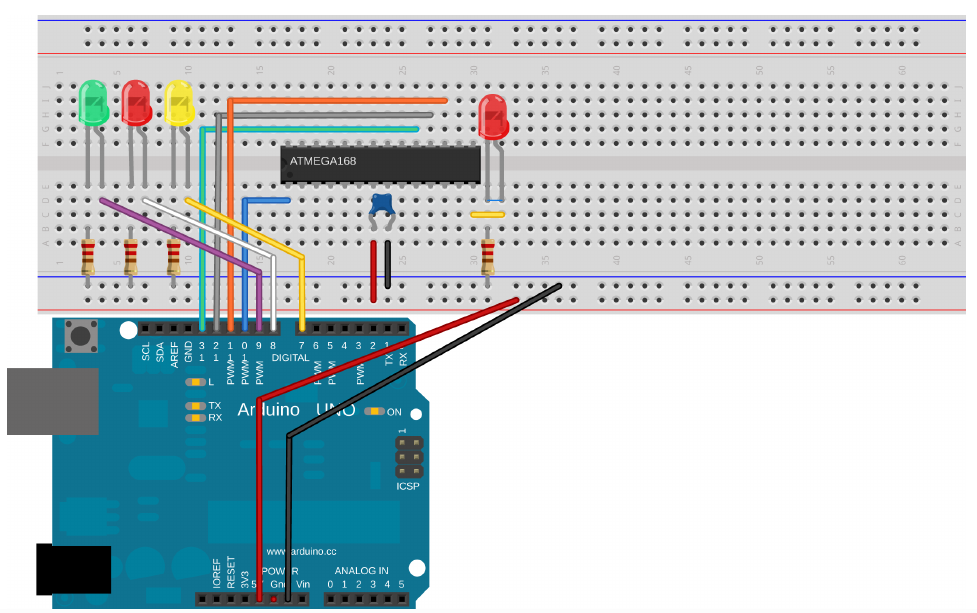

# AVR programming
## Make: AVR Programming by Elliot Williams (MAKE). Copyright 2014 Elliot Williams, 978-1-4493-5578-4.
- Setting up the toolchain for programming AVRs on Linux : `sudo apt install avrdude avrdude-doc binutils-avr avr-libc gcc-avr gdb-avr`
- As a second option, the Arduino IDE is available for all three OS platforms. Heck, most of you will have it installed already. If you’ve got Arduino up and running, there are some modifications you can make to turn your Arduino IDE into a working generic AVR C-language environment.
 - Make and Makefiles : 
    - The C programming language lets you split up one big program or task into a bunch of individual functions, and lets you keep collections of functions together in their own files for easier maintenance and portability.
    - if you want to frequently reuse some serial-port input/output functions, for instance, all you have to do is include the serial library code files (by name) in your main code, and then tell the compiler where to find these files.
    - Separating your code into functionally different files is good software design, but it means that you need to remember all of the dependencies among the different files in your codebase and type out potentially many filenames each time you compile.
    - Keeping track of all of these dependencies manually can quickly become unreasonable, and it was only a few years after C was invented that the make utility was designed to help.
    - Instead of compiling your files together manually, a file called a makefile contains a bunch of dependency rules and instructions for processing them, and then you just run the make command and everything compiles. (That’s the idea, anyway.)
    - So, for instance, you can explicitly compile all of your source files together like this: `gcc main.c another_file.c serialLibrary.c -o main` which makes an executable file, main, from all of the listed .c files. Or, you can write a makefile that maps out these dependencies: `main: main.c another_file.c serialLibrary.c` and then simply type make main or even simpler, make.
    - The make program knows that names on the left side of the “:” are targets, and on the right, their dependencies.
    - If you need to run special commands to make the targets from their dependencies, these commands are listed on the next line, indented with a tab.
    - Dependencies can, in turn, have other dependencies, and make will keep digging deeper until it can resolve them.
    - Things get complicated with makefiles when you add in variables and wildcards that match any filenames.
    - You can start to write generic rules that compile any .c files together, for example, and then you only have to change the variable definitions when you move a makefile from project to project.
    - One very real advantage of the Arduino hardware setup is that the chip comes preflashed with a bootloader, which is code that enables the chip to communicate with your computer over the serial line in order to flash program itself.
    - The second highlight of the Arduino package is that it comes with a built-in USB-to-serial converter, so you don’t have to buy a separate one just yet.
- The Arduino Is an AVR Programmer
    - 
    - Verify that your Arduino board type is set up correctly (Tools → Board → Uno in my case).
    - Flash the example code “ArduinoISP” into the Arduino hardware the usual Arduino way.
    - use blink led code
    - Select Tools → Programmer → Arduino as ISP to program through the Arduino hardware instead of programming the Arduino itself.
    Select Tools → Board → Arduino Pro Mini (8 MHz) w/ ATmega168, because we’re targeting an ATmega168 running at 8 MHz. (Nobody will know it’s not inside an Arduino Pro.)
    - Shift-click on the Upload button (Shift-Ctrl-U) to flash your code into the AVR target. If you’re too accustomed to just clicking the Upload button and forget to press Shift here, you’ll get an error like avrdude: stk500_disable(): pro tocol error, expect=0x14, resp=0x10.
    If you want to see what’s going on in the background, click File → Preferences → Show verbose output.
- Using Arduino as hardware programmer without the Arduino IDE
    - 
    - Because it’s possible to use your Arduino as a flash programmer from within the Arduino IDE, you’re probably wondering if it’s possible to flash arbitrary AVR chips without using the Arduino IDE as well. Of course it is!
