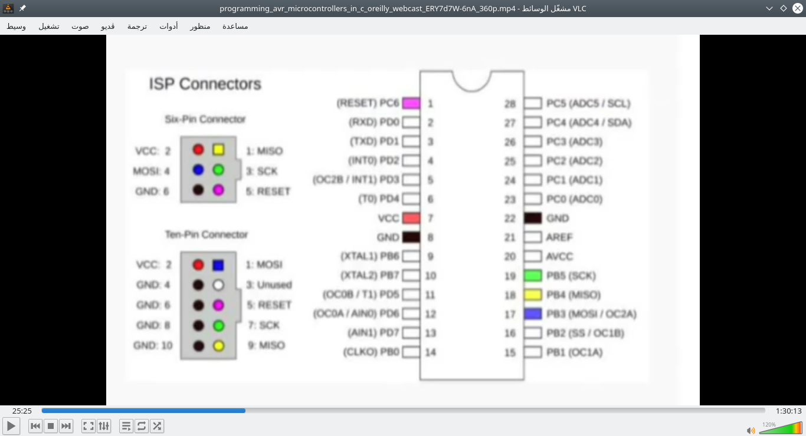

# AVR programming
## Make: AVR Programming by Elliot Williams (MAKE). Copyright 2014 Elliot Williams, 978-1-4493-5578-4.
- Why using `C` language?
    - your code will be much faster (cycles and size)
    - make the code flexible
    - `C` is available for every CPU
    - `C` will work on every AVR
- Micro controller is a whole computer on a chip, but it is very little computer
    - CPU
    - Dynamic memory
    - Non-volatile memory
- Tool chain
    - life cycle of AVR programming : `write code in C` then `compile the code to machine language` then `transfer the code to the chip` using FTDI protocol, so we need a hardware between the AVR board and the PC
- What we need to begin
    - cross compiler : GNU `avr-gcc` >> for linux users `sudo apt-get install avrdude binutils-avr avr-libc gcc-avr`
    - hardware programmer
    - AVRDUDE : knows how to run many hardware programmers
    - a makefile to compile and flash in one step
    - usb-serial converter
- Hardware
    - AVR uses the SPI interface for In-system programming (ISP)
    - Wires need to hoock up
        - Power
        - Ground
        - SCK (serial clock)
        - MISO (Maser in Slave out)
        - MOSI (Master out slave in)
        - RESET (tell the AVR to enter programming mode)
        - 
- Software
    - Arduino ISP example, flash it to arduino
    - `avrdude -p atmega168 -c avrisp -b 19200 -p /dev/ttyACM0 -nv`
    - if it runs it will give info about board, if not recheck connections
    - 
    - make file
        - to setup the make file i have to define
            - target MCU
            - programmer
            - serial port and speed
        - make sure to open the make file in the same directory of the project
    - open up terminal
    - run `make flash` or `make program`
    - type `make` to make the hex file
    - you can use `avrdude -p atmega168 -c usbtiny -U blinkLED.hex` 0R `avrdude -p atmega168 -c avrisp -b 19200 -P /dev/ttyACM0 -U blinkLED.hex` depending on the programmer
        - `-p` chip type
        - `-c` programmer type
        - `-U` hexfile file to upload
    - it is better to personalize these values in your makefile and you can use it every time without type it again
- Coding
    ```
    // where your include information from other files
    #include <avr/io.h>
    #include <util/delay.h>
    // here we can also use define function.
    // or define globale variables
    int main(void) // the C code must have one main, here                  //where the AVR starts executing your code
    {
        DDRB = 0b00000010;  // DDR, Data direction register sets pin one in PORTB (PB1) into output mode
                            // can be DDRB |= (1<<PB1); 
        while(1)            // called main loop
        {
            PORTB = 0b00000010;
            _delay_ms(1000);
            PORTB = 0b00000000;
            _delay_ms(1000);
        }
        return (0);
    }
    ```
 or `#define` : 
    - `OR` bitwise : if i want to turn on `PB1` and `PB2` ledS i should consider the following :
    ```
    0b00000010 = (1<<PB1)
    0b01000000 = (1<<PB7)
    0b01000010 = (1<<PB1) | (1<<PB7)
    ```
    - `XOR` bitwise : if i want to change the status of one led i should use this operator as follows :
    ```
     0b00001111
    ^0b00000010
     0b00001101
    ```
    - `AND` bitwise : if i want to clear a specific bit like :
    ```
     0b00001111
    &0b11111101
     0b00001101
    ```
    - `NOT` bitwise : also to clear bit :
    ```
    0b11111101=~(1<<PB1)
    ```
    - so the approperiate way is :
    ```
    PORTB = PORTB & ~(1<<PB1)
    OR
    PORTB & = ~(1<<PB1)
    ```
    - to set bit :
    ```
    PORTB | = (1<<PB1)
    ```
    - to clear bit :
    ```
    PORTB & = ~(1<<PB1)
    ```
    - to toggle bit :
    ```
    PORTB ^ = (1<<PB1)
    ```
    - there is another method to do that
    ```
    #include<avr/io.h>
    #include<util/delay.h>

    #define led PB0
    #define led_port PORTB
    #define led-ddr DDRB
    #define bv(x) (1<<x)
    #define setbit(p,b) p|=bv(b)
    #define clearbit(p,b) p&=bv(b)
    #define togglebit(p,b) p^=bv(b)
    ...
    in the main function
    setbit(led-ddr,led)
    ...
    togglebit(led-port,led)
    ```
    - i can use `#define led PB1` to use word `led` as `PB1`
    - `#include io.h` includes the following `#define PB0 0` and other definistions
- configuration
    - I/O : select input or output mode (hi-z or pullup)
    - PWM : base timer clock speed, PWM mode, toggle pin, trigger interrupt
- datasheet : page one and two then skip to the chapters you need, read chapter info and understand the block diagram
- Resgiserts : fixed memory locations with side effects, can read and write like normal variables, each register byte is bits, each bit like a switch
- How to set PWM
    - choose timer clock source
    - set up PWM mode
        - we need to set bits WGM10, WGM11, WGM12 : zero or one depending on the compination of the wanted one mode
        - so TCCR1A = 3 (for example)
- i should check that site for [newly added stuff](http://littlehacks.org) 
- search for bruce land's cornell university engineering course


- video time 50:04
    - 
