# FabLab Team Updates

## Boys
### Emad saqr - laser cutter
- Installation steps
    - 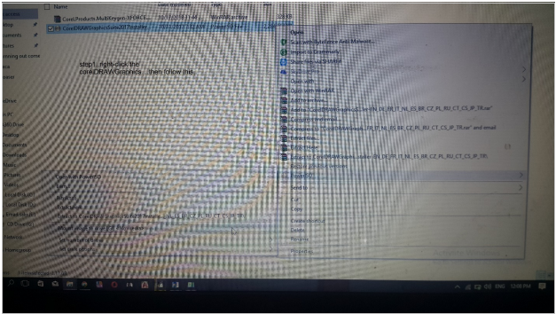
    - 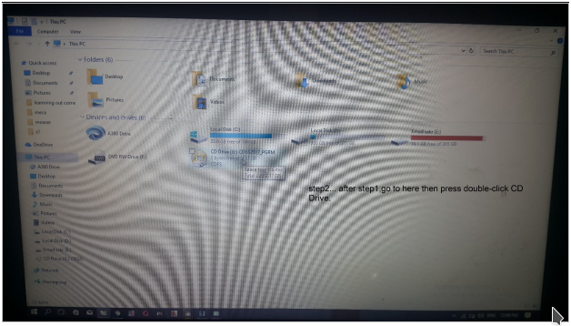
    - 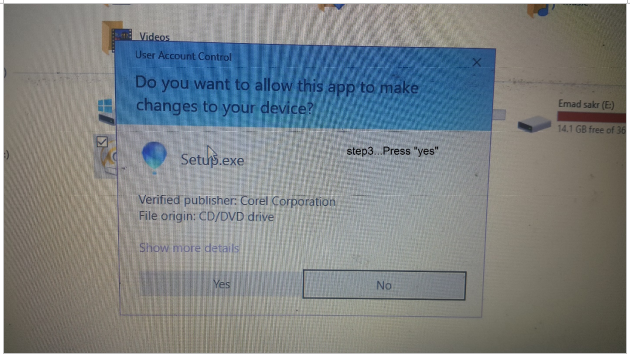
    - 
    - 
    - 
    - 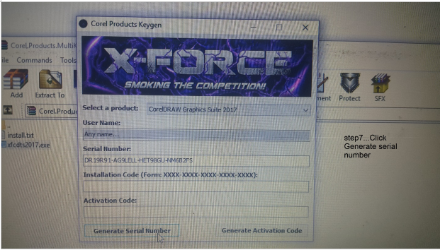
    - 
    - 
- set the document
    - 
    - the laser cutter coverts the color mode into a greyscale mode before engraving and cutting, for the most successful results please always use RGB.
    - Whether you open a file or create a new one, you will see your document view when you are prepaing your design for cutting/engraving.
    - If you have set your document to 24” x 12” in size, then you will see a document that represents the entire work area of the laser cutter.
    - The orientation of your document and the laser cutter blate are the same.
    - the X direction is the width of your document and the direction that the X Carriage of the laser cutter travels. Likewise, the Y direction is the height of your document and is the direction that the Y Carriage that the laser cutter travels.
    - The home position for both is the top-left corner.
    - 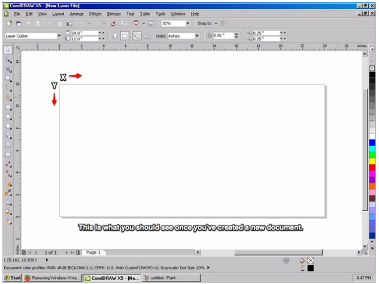
- Setting up an Object to be Cut
    - Vector cutting is when the machine is tracing the shapes of the vectors cutting through the material. 
    - If we want to cut shapes out of our material, this is the mode we want the laser to be in.
    - In order to the machine to cut an object out, we have to set the properties of that object to `No Fill = remove the fill of the object` and `Stroke Color = set the stroke color to black (RGB = #000)` and `Stroke Width = set the stroke width to “hairline”`
    - 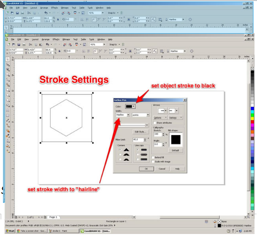
- setting up an object to be rastered
    - Rastering is when the machine is engraving a graphic into the material.
    - it is a similar process to an inkjet printer except that it removes materials to create the graphic instead of adding layers of ink.
    - Raster engraving is a bit more forgiving than vectoring, we have some room for experimenting with different settings.
    - This also means there is not a clear path to a “good” engrave, that will determined by you and the job you are trying to do.
    - In general the following properties can be applied for engraving jobs `No Stroke = remove the stroke of the object to avoid accidentally cutting it out` and `Fill Color = set it to black (RGB = #000)`
    - 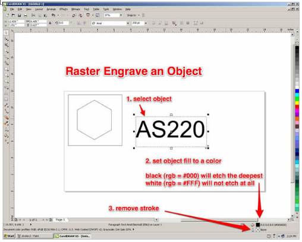
- print the job on laser
    - Once you have gone through and properly formatted all of your vector cuts and rasters, you are ready to set up the appropriate machine settings based on the material that you are using.
    - This is a very crucial step! Failure to pay attention to all the settings and you may ruin a perfect piece of material.
    - To edit the machine settings to print, first, open "file" then chose print or press "ctrl p"
    - 
    - print window appears, Printer should be set to “Epilog Engraver WinX64”
    - then, open up preferences to edit the machine properties.
    - 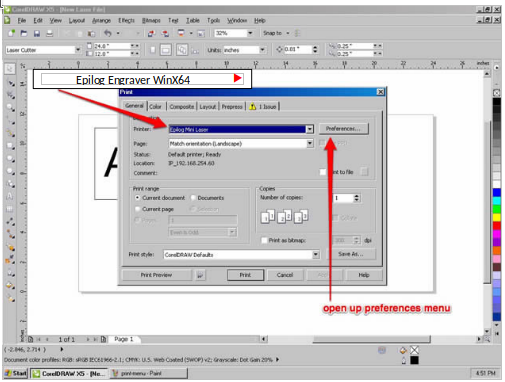
    - Resolution (only if you are engraving)
        - If you are engraving any objects into the material, you need to select the resolution you want the machine to operate at.
        - It has the ability to do high resolution (1200dpi max) for really delicate and detailed engraving, but it also has the ability to do low res work (75 dpi min) for rough sketches or mark making. 300dpi is a good standard resolution to use for most jobs.
        - An important to know if that job time increases significantly with an increase in resolution. If you are just prototyping, its usually best to keep the resolution low.
        - 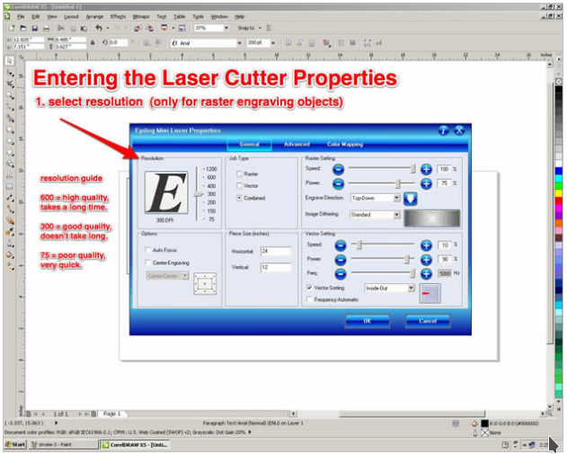
    - Job Type : There are three different types of job types on the laser cutter
        1. `Raster` : used for only engraving onto material
        2. `Vector` : used for only cutting through a material
        3. `Combined` : used for doing both engraving and cutting in the same job
        - 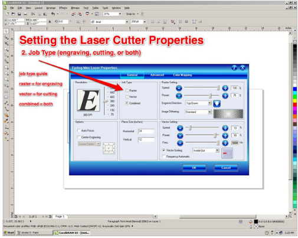
    - Options
        - The only option you ever need to change is “Auto Focus”.
        - By default, this will be set to be off, which means you need to manually focus the machine.
        - If you want to use the auto focus feature on the machine, click on the button to activate it.
        - 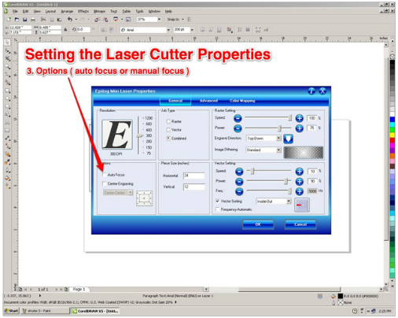
    - Piece Size
        - This is important, If you do not change this, it will be set to 8.5” x 11” by default.
        - This is not the size of the laser cutter or your document, and it will result in an incorrect job.
        - Change this to 24” x 12” which matches your document, this will give you the best results. And it must be in <b>inches</b>
        - 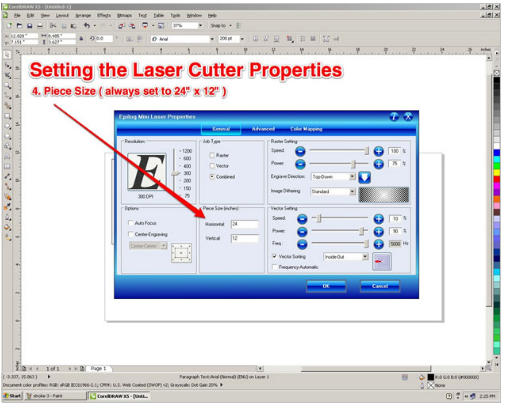
    - Raster Settings (if applicable) : If you are doing any engraving you will need to set :
        1. `Speed` : This controls how fast the machine will engrave into the material. Slower speed will result in more  etching power, because it will be spending more time on the same spot of the material
        2. `Power` : This controls how much power (out of 40 Watts) you use to engrave. higher power means the power of the laser will be higher resulting in the engraving will be deeper.
        - Please refer to Epilog’s Material Settings guide to know the approperiate settings you will need according to the material used
        - 
        - 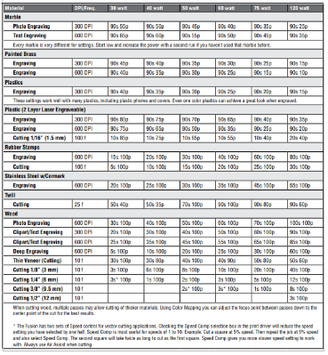
        - 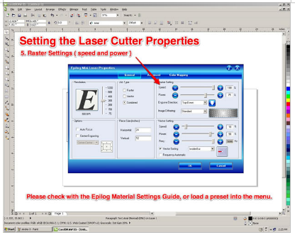
    - Vector Settings (if applicable) : If you are doing any cutting you will need to set :
        1. `Speed` : This controls how fast the machine will engrave into the material. Slower speed will result in more  etching power, because it will be spending more time on the same spot of the material
        2. `Power` : This controls how much power (out of 40 Watts) you use to engrave. higher power means the power of the laser will be higher resulting in the engraving will be deeper.
        3. `Frequency` : The laser is not a continuous stream of energy, it is actually pulsing down on your material. The rate at which it does so is determined by the frequency. You can set it from 20-5000 Hz (pulses per second).
        4. `Vector Sorting` : You select from “inside-out” which will cut the vectors in your design from the inside out, prevent larger objects with inside cuts to cut first. The other option is “optimize” which will cut your design in the most efficient way.
        - 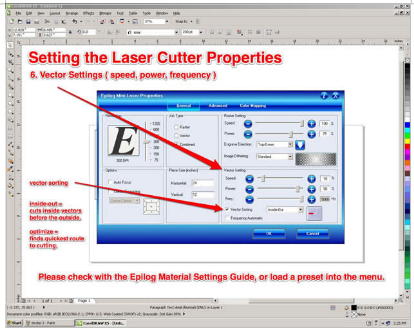
    - Sending the Job
        1. nce you have fill in all of the settings you need, double check to make sure everything is okay.
        2. Then press “OK”.
        3. You will then be brought back to the normal print menu, click “Apply” to save the settings in case you need to go back and make some small tweaks, otherwise you’ll have to start from scratch.
        4. Finally, select “Print” on the print menu and your job will be sent to the laser cutter and will show up on the display screen of the machine.
        - 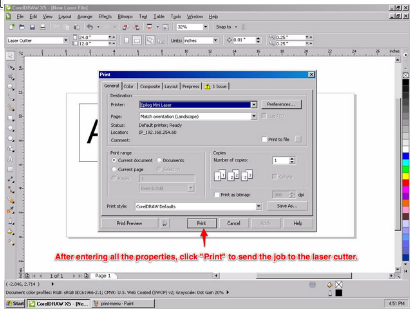
    - Free Laser Cutting Designs
        - [3axis](https://3axis.co/free-vectors/3d+dxf+files+free/page/2/)
        - [youmagine](https://www.youmagine.com/designs/latest)
        - [123rf](https://www.123rf.com/clipart-vector/laser_cut.html?sti=nsbcg4fv6leqkgslot|)
        - [thingiverse](https://accounts.thingiverse.com/?redirect=YToyOntzOjQ6InR5cGUiO3M6ODoicmVkaXJlY3QiO3M6NDoiZGF0YSI7czozNzoiaHR0cHM6Ly93d3cudGhpbmdpdmVyc2UuY29tL2Rhc2hib2FyZCI7fQ)
        - [obrary](https://obrary.com/collections/open-designs)
        - [freepik](https://www.freepik.com/)
        - [librarylaser](https://www.librarylaser.com/en/free-designs-36?p=6)

## Girls