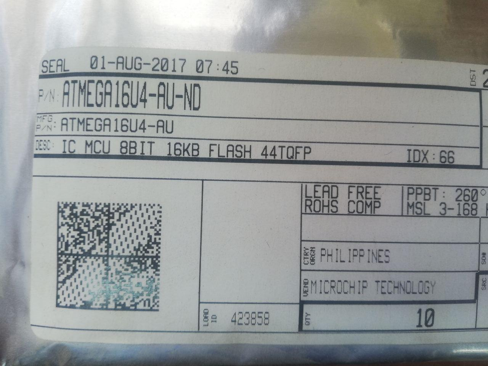
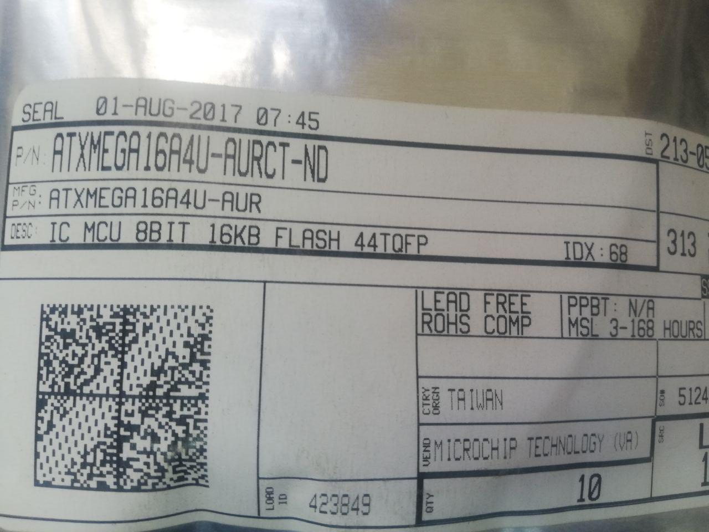
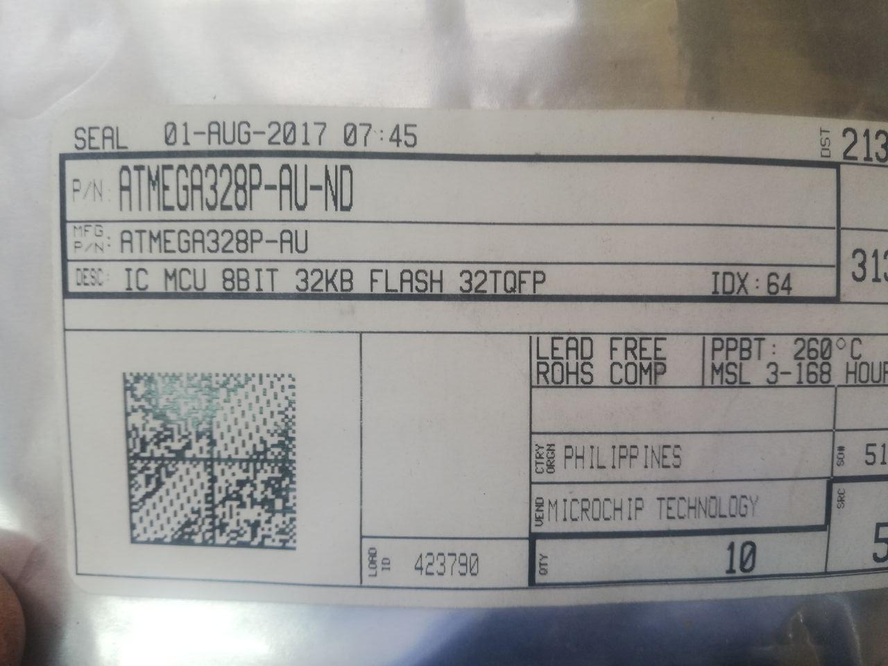
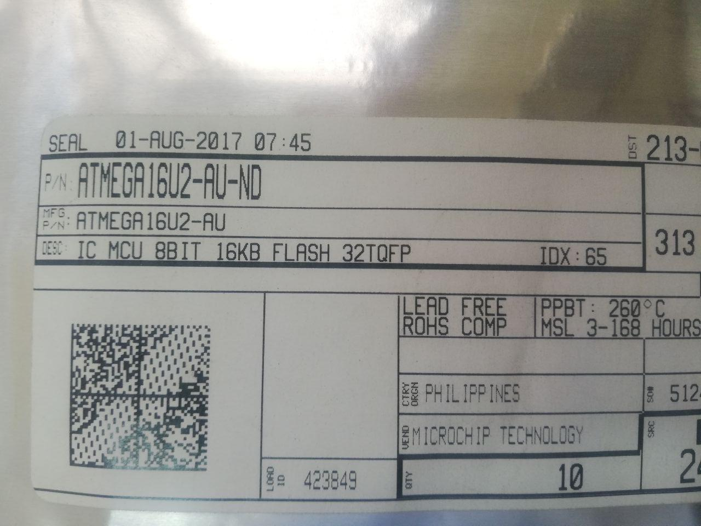
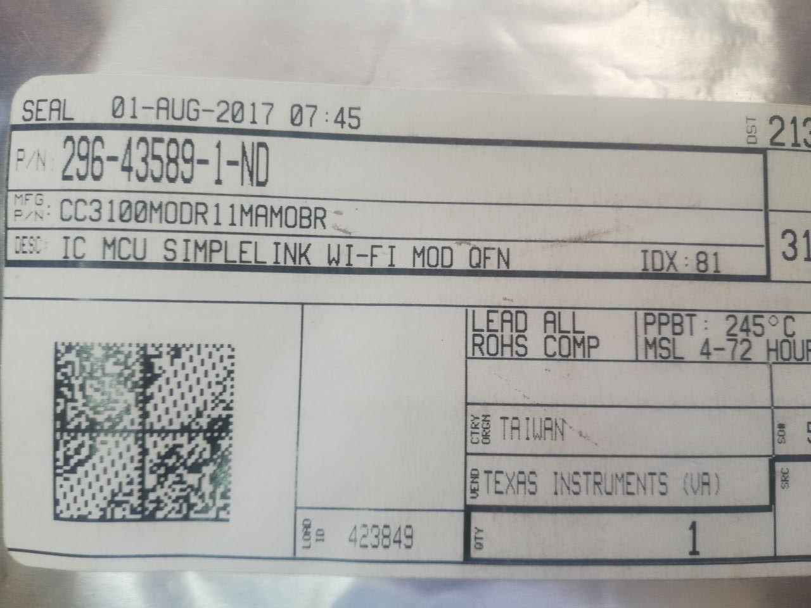

# Electronics components
- Micro controller
    - 
    - 
    - 
    - 
    - 
    - 
    - 
    - 
- Led
    - 
    - 
    - 
    - 
    - 
    - 
    - 
    - 
    - 
    - 
    - 
    - 
- Inductor
    - 
    - 
    - 
    - 
- Speaker
    - 
- Crystal
    - 
    - 
    - 
- Regulator
    - 
    - 
    - 
    - 
    - 
- RF module
    - 
    - 
    - 
    - 
    - 
    - 
- Audio amplifier
    - 
    - 
- OP amplifier
    - 
    - 
    - 
    - 
- MIC
    - 
    - 
    - 
    - 
- Motor driver
    - 
    - 
- Accelerometer
    - 
    - 
- Magned
    - 
- Photo transistor
    - 
    - 
- Diode zener
    - 
    - 
- Connectors
    - 
    - 
    - 
    - 
    - 
    - 
    - 
    - 
    - 
    - 
    - 
    - 
- Switch
    - 
    - 
- Emitter IR
    - 
    - 
- MOSFET
    - 
    - 
    - 
    - 
    - 
    - 
    - 
- IC receiver
    - 
    - 
- NTC thermistor
    - 
- LCD module
    - 
    - 
- Diode schottky
    - 
    - 
    - 
    - 
- Capacitors
    - 
    - 
    - 
    - 
    - 
    - 
    - 
    - 
    - 
    - 
- Resistors
    - 
    - 
    - 
    - 
    - 
    - 
    - 
    - 
    - 
    - 
    - 
    - 
    - 
    - 
    - 
    - 
    - 
    - 
    - 