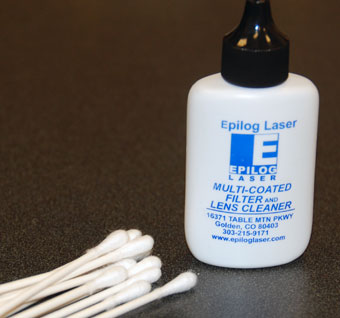
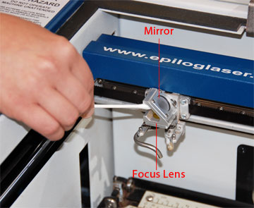
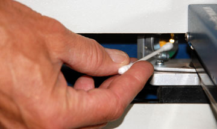
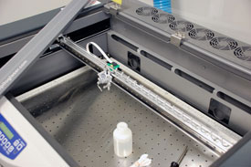
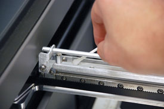
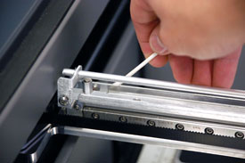

# Laser cutter - Epilog 24*12

## Purpose

## Minimum knowledge to use machine
- Raster engraving
    - very high resolution dot matrix printing with a laser
    - used to create highly detailed graphic images
    - laser head scans back and forth, left to right, engraving series of dots one line at a time
- Vector cutting
    - when you are vector cutting the laser is following a continous path that follows the outline of an image
    - used to cut completely through materials
    - you can vector cut with the laser by setting the outline to 0.025 mm, the thing outline will produce a vector cut
- Do not run the laser unvented
- Do not engrave or cut PVC
- Do not operate while unattended
- Do not oprate Exhaust/Filter motors until making sure your job is ready to be cut
- Turn off the Exhaust/Filter motors after cutting

## Materials

## Working time

## Maintenance
- Weekly maintenance include cleaning the machine and check it's functionality
- Yearly maintenance include cleaning the machine and internal parts, and replace faulty parts if nessary
- Aligning laser beam

### Procedures
- Cleaning the plate area
    - Remove the blate and clean the container under the plate
    - Cleaning the rulers using glass cleaner spray
    - using tooth brush also is useful in some cases when the tissue is not effective
    - use many zip tie to clean the exhaust/filter path
    - clean the sensor using tissue, then using the alcohol and cotton
    - clean the glass using glass spary cleaner
- Cleaning the optics
    - clean the mirrors and lenses of the laser
    - The two optical components most likely to require cleaning are the focus lens and the mirror directly above it
    - never use alcohol or hardware grade acetone  
      
      
    
- Cleaning the X-Axis Linear Encoder Strip
    - There are seven screws that attach the x-axis linear guide cover, Unscrew each of the screws until each one is loose enough to remove the linear guide cover
    - You will not need to completely remove all of the screws to remove the cover
    - The linear encoder strip is the clear plastic strip that runs along the width of the x-axis beam
    - Using the cotton swab dipped in distilled water, wipe the cotton swab along the front and back side of the linear encoder strip to remove any smoke or dust debris that might have collected on the strip
    Once you've finished wiping down each side of the encoder strip, go back with a dry cotton swab and wipe away any moisture that might have been left behind  
      
      
      
- Lubricate the x-axis (the long side) bearing rail, after cleaning the rail place about an inch long bead of epilog supplied grease into the top and bottom grooves of the x-axis rail
- clean the right side y-axis rail using soft cotton cloth, lubrication is not required

### Date

## Jops

## advanced
- Center engraving : this option has been designed to be used in conjuction with the x/y off feature on the control panel
- 3D Mode : When selected, instead of looking at the dots and detemining where to fire the laser based on the dot spacing, we look at the dots and determine how much laser power to apply to each do, allowing us to create a 3D effect
- Stamp mode : this function automatically inverts your artwork so that the background is engraved away while your text and graphic images are left standing
- Color mapping tab : the laser will use the settings assigned to each color
- landscape mode takes less time in raster than portrait mode
- it is better to raster so the laser cutting be in parallel to grain than it is perpendicular to it
- it is preferred to fix the job size according to the table size, and change the job position
- 