# Monofab - srm20   
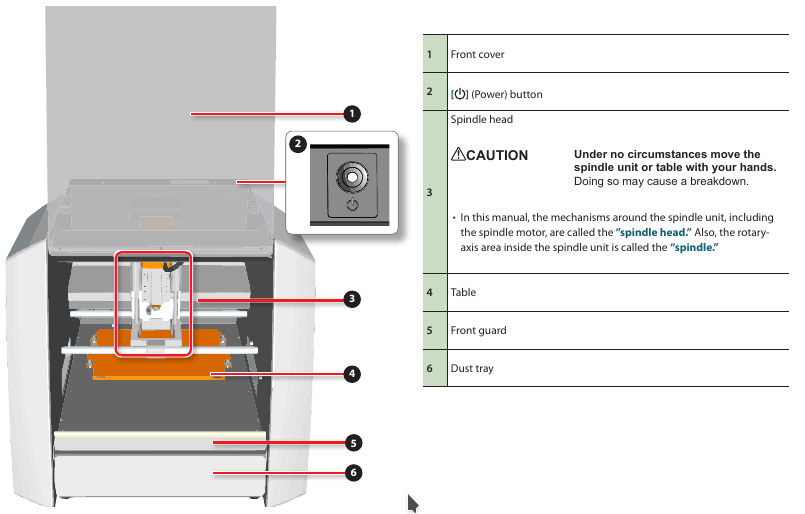   
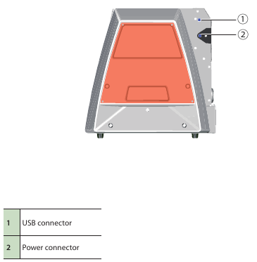

## Purpose
- This machine is capable of cutting a wide variety of materials including chemical wood, acrylic, and ABS
- it can be used in milling, casting or pcb production

## Minimum knowledge to use machine
- cutting tools   
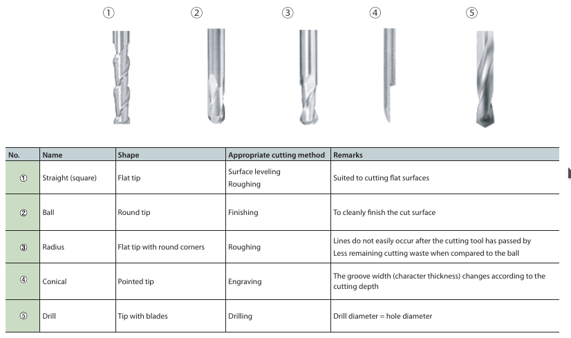

- cutting area x,y   
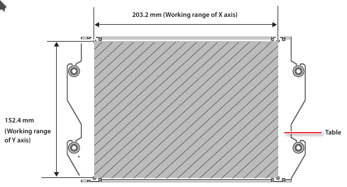

- cutting area z   
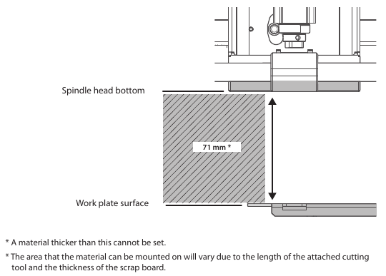

- softwares used
    - `vpanel` : to control the axis and start the job   
    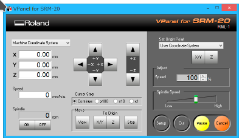

    - `SRP Player` : This is a CAM software that imports general-use 3D data, (such as IGES, DXF (3D), or STL), and lets you easily prepare tool paths and output them to the SRM-20.   
    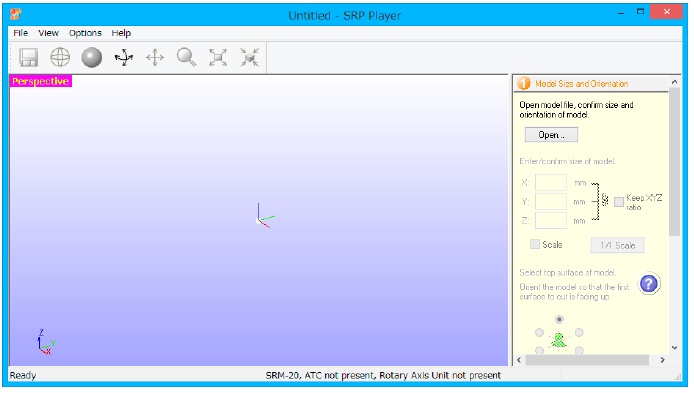

    - `Modela Player 4` : This is a CAM software that imports general-use 3D data, (such as IGES, DXF (3D), or STL), and lets you easily prepare tool paths and output them to the SRM-20.   
    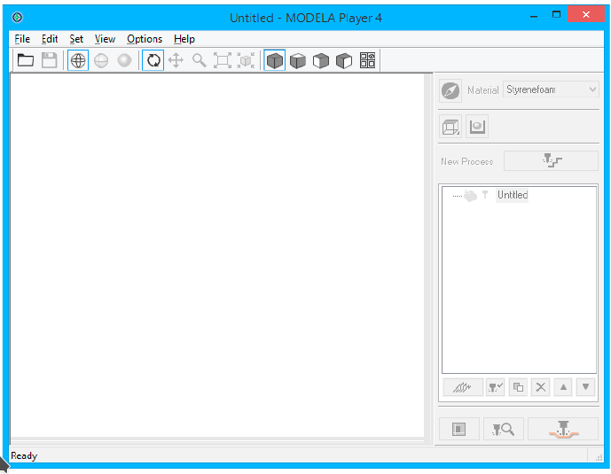

- The Flow of One Side Cutting   
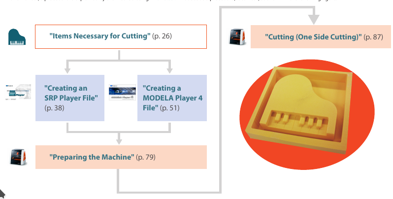

- Preparing the Machine   
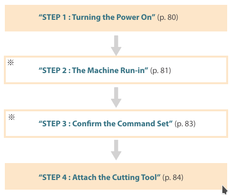

- attaching the cutting tool   
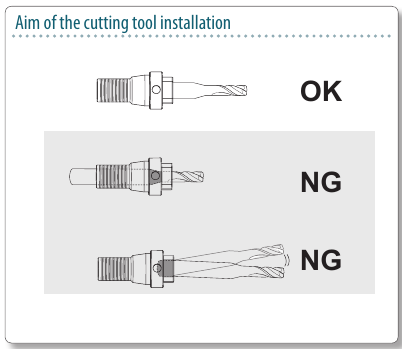   
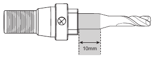

- attach the material to the table
    -  Mark the location that will be the origin point of the material.   
    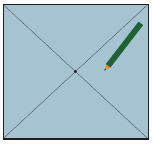

    - Stick double-stick tape on the material.   
    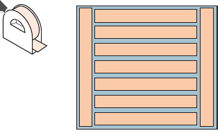

    - set the origin of the vpanel   
    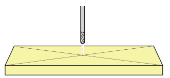

- Loadable workpiece weight : 2 kg
- operating speed : 6 ~ 1800 mm/min
- maximum spindle rotation : 7,000 rpm

## Materials
- Chemical wood
- Sanmodur
- ABS
- Modeling wax

## Working time

## Maintenance
- 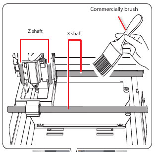
- 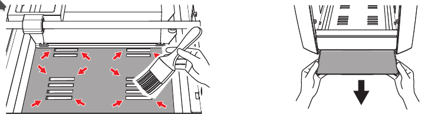
- 
- 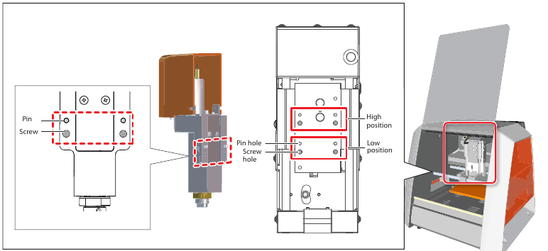
### Procedures

### Date

## Jops

## advanced
- Z Cutting Range by Changing the Position of the Spindle Unit   
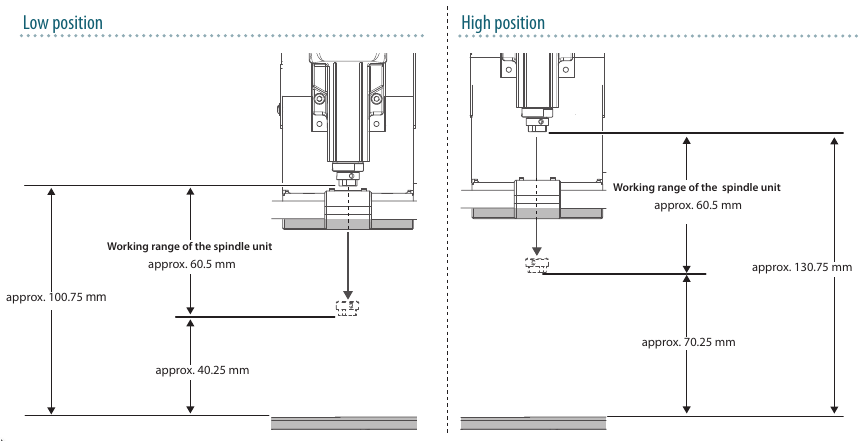