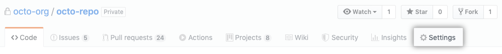
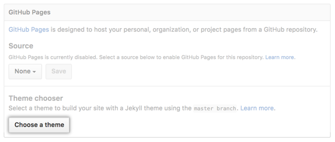
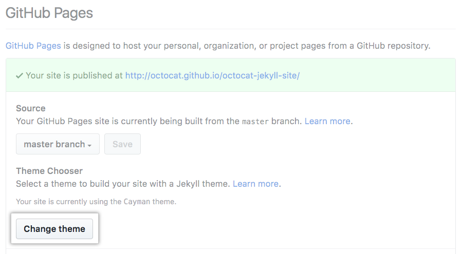
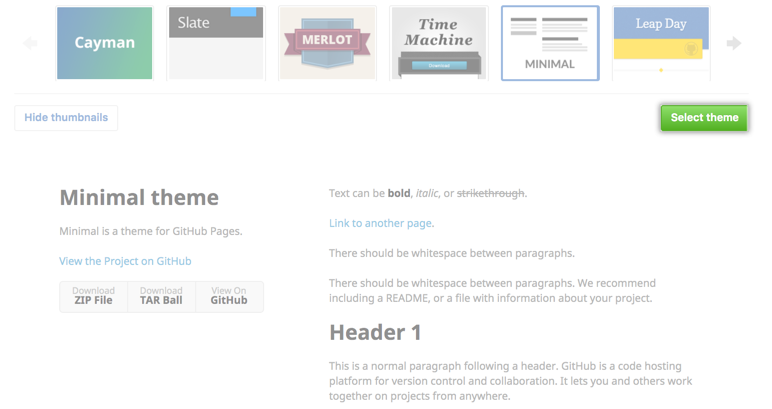

# New challenges

## jekyll

###  What is jekyll

- Jekyll is a simple, extendable, static site generator. You give it text written in your favorite markup language and it churns through layouts to create a static website.
- Jekyll is written in Ruby
- A gem is code you can include in Ruby projects, It allows you to package up functionality and share it across other projects or with other people
- Gems can perform functionality such as
    - Converting a Ruby object to JSON
    - Pagination
    - Interacting with APIs `what is API : When you use an application on your mobile phone, the application connects to the Internet and sends data to a server. The server then retrieves that data, interprets it, performs the necessary actions and sends it back to your phone. The application then interprets that data and presents you with the information you wanted in a readable way. This is what an API is - all of this happens via API` such as GitHub
    - Jekyll itself is a gem as well as many Jekyll plugins including jekyll-feed, jekyll-seo-tag and jekyll-archives
- A Gemfile is a list of gems required for your site
- Bundler installs the gems in your Gemfile
- It’s not a requirement for you to use a Gemfile and bundler, You only need to install it once — not every time you create a new Jekyll project
- Jekyll is a static site generator so we need Jekyll to build the site before we can view it.
- http://simpleprimate.com/blog/markdown-basics

### How to install

- `sudo apt-get install ruby-full build-essential zlib1g-dev`
- `echo '# Install Ruby Gems to ~/gems' >> ~/.bashrc`
- `echo 'export GEM_HOME="$HOME/gems"' >> ~/.bashrc`
- `echo 'export PATH="$HOME/gems/bin:$PATH"' >> ~/.bashrc`
- `source ~/.bashrc`
- `gem install jekyll bundler`

if problems happend
- `sudo gem update --system`
- `bundle install`
- `bundle exec jekyll serve`

### How to work
- Working with github pages      
    GitHub Pages is available in public repositories with GitHub Free, and in public and private repositories with GitHub Pro, GitHub Team, GitHub Enterprise Cloud, and GitHub Enterprise Server.
    1. Create a repository  
        Head over to GitHub and create a new repository named username.github.io, where username is your username (or organization name) on GitHub
    2. Clone the repository  
    `git clone https://github.com/username/username.github.io`
    3. Enter the project folder and add an index.html file  
    `cd username.github.io`
    `echo "Hello World" > index.html`
    4. Add, commit, and push your changes  
    `git add --all`  
    `git commit -m "Initial commit"`  
    `git push -u origin master`
    5. Fire up a browser and go to https://username.github.io  
    
- Jekyll themes on GitHub
    1. If you don't already have a repository for your GitHub Pages site, create a new repository with a README.
    2. Navigate to your GitHub Pages site's repository
    3. Under your repository name, click Settings  
    
    4. On the settings page, scroll down and under "GitHub Pages"  
        - Click Choose a theme to add a theme to your site for the first time  
        
        - Click Change theme to change an existing theme for your site  
        
    5. On the theme selection page, review your theme options. To choose a theme, click the theme you want and then click Select theme  
    
- select theme from git `settings` then `github pages` then `change theme`

## pandoc

### what is pandoc

`If you need to convert files from one markup format into another, pandoc is your swiss-army knife`

### how to install

- `sudo apt-get update`
- `sudo apt-get install pandoc`
- `apt install dpkg`
- `dpkg -L pandoc`
- `pandoc -v`

### How to work

## mkdocs

### What is mkdocs

`MkDocs is a fast, simple and downright gorgeous static site generator that's geared towards building project documentation. Documentation source files are written in Markdown, and configured with a single YAML configuration file.`

### How to install

- install python https://www.python.org/downloads/source/
- install pip https://pip.readthedocs.io/en/stable/installing/

### How to work

## gohugo

### What is gohugo

`Hugo is one of the most popular open-source static site generators. With its amazing speed and flexibility, Hugo makes building websites fun again.`

### how to install

- `brew install hugo`
- Prerequisite Tools
    - http://git-scm.com/
    - https://golang.org/dl/

### how to work

#### install gohugo
- install hugo  
`sudo apt-get install hugo`
- To verify your new install  
`hugo version`
- Create a New Site  
`hugo new site quickstart`
- Add a Theme from a website https://themes.gohugo.io/
- This quickstart uses the beautiful [Ananke theme](https://themes.gohugo.io/gohugo-theme-ananke/)  
`cd quickstart`  
`git init`  
`git submodule add https://github.com/budparr/gohugo-theme-ananke.git themes/ananke`  
echo 'theme = "ananke"' >> config.toml
- Submodule :
    - Let’s say you’re working on a project called Slingshot. You’ve got code for y-shaped stick and a rubber-band
    - At the same time, in another repository, you’ve got another project called Rock—it’s just a generic rock library, but you think it’d be perfect for Slingshot
    - You can add rock as a submodule of slingshot. In the slingshot repository
    - `git submodule add https://github.com/<user>/rock rock`
    - At this point, you’ll have a rock folder inside slingshot, but if you were to peek inside that folder, depending on your version of Git, you might see … nothing
    - Newer versions of Git will do this automatically, but older versions will require you to explicitly tell Git to download the contents of rock
    - If everything looks good, you can commit this change and you’ll have a rock folder in the slingshot repository with all the content from the rock repository
    - On GitHub, the rock folder icon will have a little indicator showing that it is a submodule
    And clicking on the rock folder will take you over to the rock repository
- Add Some Content  
`hugo new posts/my-first-post.md`
- Start the Hugo server
`hugo server -D`
- i used another theme called learn, after making the page now i want to customize it, using this website https://learn.netlify.com/en/
- install hugo
- install go
    - `sudo apt-get update`
    - `sudo apt-get -y upgrade`
    - `wget https://dl.google.com/go/go1.12.6.linux-amd64.tar.gz`
    - `sudo tar -xvf go1.12.6.linux-amd64.tar.gz`
    - `sudo mv go /usr/local`
    - `export GOROOT=/usr/local/go`
    - `export GOPATH=$HOME/Projects/Proj1`
    - `export PATH=$GOPATH/bin:$GOROOT/bin:$PATH`
    - All the above environment will be set for your current session only. To make it permanent add above commands in ~/.profile file.
    - `go version`
    - `go env`
    - the website https://t ecadmin.net/install-go-on-ubuntu/
- Front matter
    - Hugo allows you to add front matter in yaml, toml, or json to your content files
    - Front matter allows you to keep metadata attached to an instance of a content type—i.e., embedded inside a content file—and is one of the many features that gives Hugo its strength
    Front Matter Formats
    - Hugo supports four formats for front matter, each with their own identifying tokens.
    - TOML
        - identified by opening and closing +++.
    - YAML
        - identified by opening and closing ---.
    - JSON
        - a single JSON object surrounded by ‘{’ and ‘}’, followed by a new line
    - Front Matter Variables
        - Predefined
        - aliases
        - audio
        - date
        - description
        - draft
        - expiryDate
        - headless
        - images
    - https://gohugo.io/content-management/front-matter/
- https://gohugo.io/getting-started/usage/
- deploy your website : https://gohugo.io/getting-started/usage/
- hosting on github : https://gohugo.io/hosting-and-deployment/hosting-on-github/